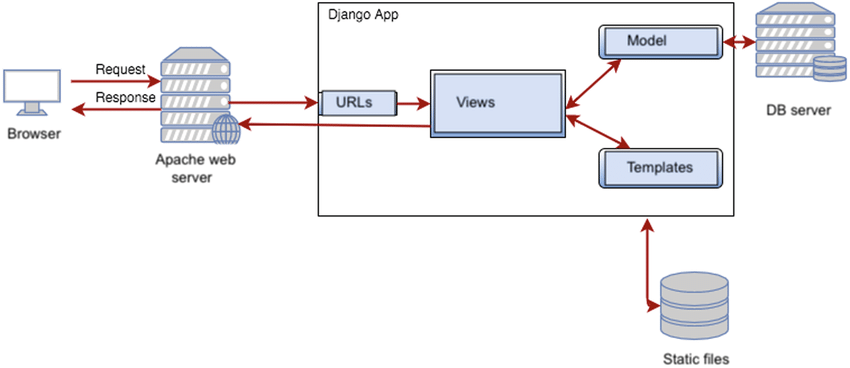

# DJANGO PROYECT

## Instalacion - Linux
1. Crear una carpeta para el proyecto

`./home/*/Django/proyecto-django`

2. Crear un entorno virtual dentro del a carpeta anteriormente creada
~~~ bash
python3 -m venv venv
~~~
3. Activar el entorno virtual
~~~ bash
source /venv/bin/activate
~~~
El entorno se desactiva con el comando `deactivate` en consola

4. Instalar Django
~~~ bash
pip install Django
pip list
~~~

## Crear proyecto

Inicializar el proyecto Django
~~~ bash
django-admin startproject
~~~

Podemos exportar las depemndencias del proyecto con
~~~ bash
pip freeze >> dependences.txt
~~~

Esto lo hacemos por si queremos inicializar el mismo proyecto en otra pc, para instalar las dependencias utilizamos el comando
~~~
pip install -r dependences.txt
~~~
## Manage.py
Una utilidad de la linea de comandos que le permite interactuar con este proyecto Django de diferentes formas.
- Correr el servidor local
- Procesos de bases de datos

## __init__.py
Un archivo vacio que le indica a Python que este directorio deberia ser condiderado como un paquete Python.

## settings.py
Ajustes/configuracion para este proyecto Django. Django settings le indicara todo sobre como funciona la configuracion.
- Aplicaciones que vayamos a instalar
- Librerias externas
- Templates
- Conecciones con la base de datos
- Debug = True // en deploy ponerlo en false

## urls.py
Las declaraciones URL para este proyecto Django, una {tabla de contenidos} de su sitio basado en Django
- Ruteo

## wsgi.py
Un punto de entrada para los servidores web compatibles con WSGI pueden servir su proyecto
- Se usa mas cuando se hace el deploy

# Funcionamiento del framework
La arquitectura de Django es MVT, muy similar al MVC, pero el controller aca es la vista y la vista son los templates.

# Creacion de vistas
Django trabaja con la clase **Request** para hacer peticiones y para enviar la respuesta utiliza **HttpResponse**

Una funcion de vista, o **"view"** para abreviar, es simplemente una funcion de **Python** que toma una web **request** y devuelve una web **response**. Esta respuesta puede ser el contenido HTML de una pagina web, o una redireccion, o un error 404, o un documento XML, o una imagen, etc. Ejemplo: Ten en cuenta que necesitas asociar una vista a una URL para verla como una pagina web.

Cada vez que se hace un request de una pagina, Django crea un objeto **HttpRequest** que contiene metadatos sobre el request. Despues, Django carga la vista apropiada pasando el objeto **HttpRequest** como primer argumento a la funcion de la vista. Cada vista es responsable de devolver un **HttpResponse**. Ambos objetos estan definidos en **django.http**

## Ejemplo practico: Creacion de vistas

1. Crear un archivo donde se almacenan las vistas que vayamos creando, se llama views.py por convencion dentro de la carpeta de la main app. Posteriormente este **no lo haremos en el main app**, pero si en las apps.

En el archivo **views.py** importar **django.http** con:
~~~ py
from django.http import HttpResponse
~~~

2. Cada funcion dentro de larchivo **views.py** es una vista. Se puede pasar HTML como respuesta, pero **no se debe hacer asi**, para eso se utilizaran las plantillas.
~~~ py
from django.http import HttpResponse

def saludo(request):
    return HttpResponse("Hola a todos!")

def saludo_html(request):
    documento="""<html><body><h1>Hola a todos!</h1></body></html>"""
    return HttpResponse(documento)

def despedida(request):
    return HttpResponse("Hasta luego!")
~~~

2. Cada funcion dentro de larchivo **views.py** es una vista. Se puede pasar HTML como respuesta, pero **no se debe hacer asi**, para eso se utilizaran las plantillas.
~~~ py
from django.http import HttpResponse

def saludo(request):
    return HttpResponse("Hola a todos!")

def saludo_html(request):
    documento="""<html><body><h1>Hola a todos!</h1></body></html>"""
    return HttpResponse(documento)

def despedida(request):
    return HttpResponse("Hasta luego!")
~~~